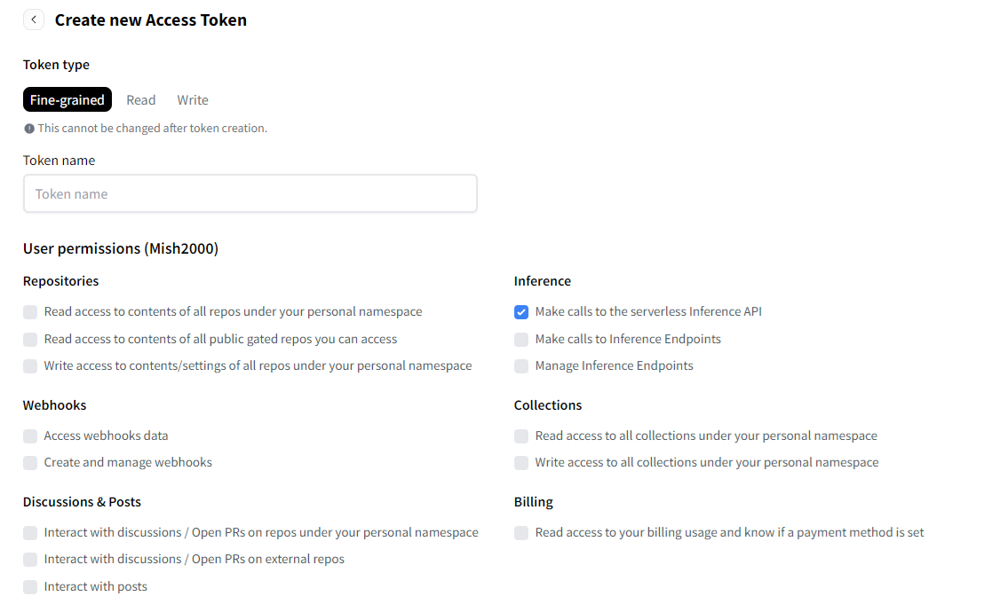

# AI Chef Project

This project is an AI-powered application that requires a Hugging Face API token to work. Follow these simple steps to set it up.

## How to Use

### Step 1: Create an Account on Hugging Face
1. Go to the [Hugging Face website](https://huggingface.co/).
2. Sign up for a free account or log in if you already have one.

### Step 2: Create a Token
1. After logging in, navigate to your account settings.
2. Find the section for creating an API token.
3. Use the options in the token creation interface to ensure the token has the correct functionality (refer to the screenshot provided for guidance).
4. Copy the generated token.



### Step 3: Set Up the `.env` File
1. In the root folder of this project, create a new file named `.env`.
2. Open the `.env` file in a text editor and add the following line:
   ```
   VITE_HF_ACCESS_TOKEN=the-token
   ```
   Replace `the-token` with the API token you copied from Hugging Face.
3. Save the file.

### Step 4: Run the Project
- Follow your standard process to run the project (e.g., `npm start` or `yarn start`).

That's it! The project should now be ready to use. If you encounter any issues, double-check the `.env` file to ensure the token is correctly set.
